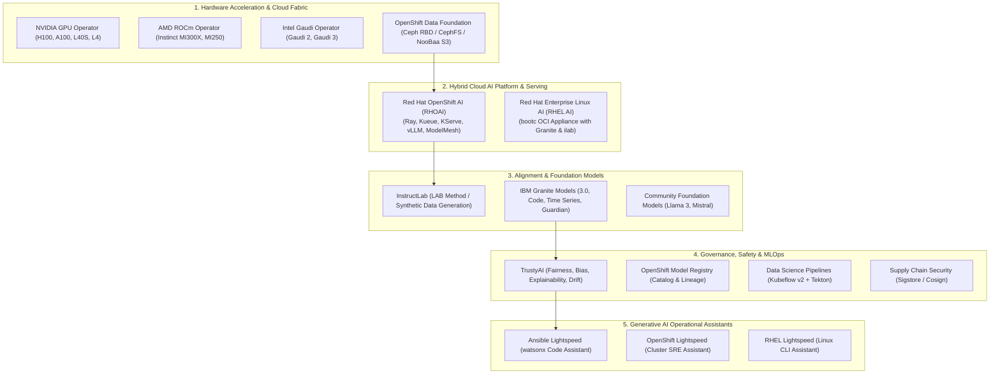

# Red Hat Enterprise AI — Master Architecture & Technical Knowledge Base

> **Platform Scope**: Red Hat Enterprise Linux AI (RHEL AI) & Red Hat OpenShift AI (RHOAI)  
> **Ecosystem**: InstructLab (`ilab`), IBM Granite Models, KServe, vLLM, KubeRay, Kueue, TrustyAI  
> **Audience**: Principal Cloud Architects, Lead Systems Engineers, Platform SREs, MLOps Practitioners  
> **Target Version**: RHEL AI 1.x, OpenShift AI 2.14+, OpenShift Container Platform 4.16+  
> **Knowledge Container**: `/workspace/projects/rh-ai` & `/workspace/knowledge/spaces/rh-ai/`

---

## 🧭 Master Portfolio Topology

Red Hat's AI portfolio spans from bare-metal edge appliances to multi-thousand GPU distributed hyperscaler clusters, standardizing on open-source weights, declarative Kubernetes orchestration, and enterprise IP indemnification.



---

## 📚 Complete Knowledge Base Navigation

The knowledge base is structured into 18 exhaustive engineering modules covering strategy, systems, alignment, serving, governance, hardware, competitive positioning, and inference engine architectures:

| Module | Title & Focus Area | Key Architectural Topics |
| :---: | :--- | :--- |
| [**01**](01-red-hat-ai-portfolio-overview.md) | [**Red Hat AI Portfolio Overview & Strategic Architecture**](01-red-hat-ai-portfolio-overview.md) | Strategic vision, full-stack mapping, RHEL AI vs. RHOAI boundary, upstream decoupling, enterprise IP indemnity. |
| [**02**](02-rhel-ai-architecture-and-deployment.md) | [**RHEL AI Architecture & Deployment Guide**](02-rhel-ai-architecture-and-deployment.md) | Bootable containers (`bootc`), transactional updates, ISO/QCOW2/AMI artifacts, `ilab` bootstrap, single-node setup. |
| [**03**](03-instructlab-and-model-alignment.md) | [**InstructLab & LAB Alignment Methodology**](03-instructlab-and-model-alignment.md) | LAB method, Skills vs. Knowledge Git taxonomy, Synthetic Data Generation (SDG), multi-phase tuning (LoRA/QLoRA/Full). |
| [**04**](04-openshift-ai-rhoai-architecture.md) | [**Red Hat OpenShift AI (RHOAI) Platform Architecture**](04-openshift-ai-rhoai-architecture.md) | `rhods-operator`, `DataScienceCluster` & `DSCI` CRDs, Workbenches, KServe vs ModelMesh, Ceph ODF storage tiers. |
| [**05**](05-distributed-training-and-orchestration.md) | [**Distributed Training & Workload Orchestration**](05-distributed-training-and-orchestration.md) | Kueue batch gang scheduling, KubeRay & CodeFlare SDK, PyTorchJob, FSDP/ZeRO-3, Multus CNI, RoCEv2/SR-IOV fabrics. |
| [**06**](06-model-serving-kserve-and-vllm.md) | [**High-Performance Model Serving (KServe & vLLM)**](06-model-serving-kserve-and-vllm.md) | PagedAttention memory paging, continuous batching, chunked prefill, Serverless vs RawDeployment, KEDA autoscaling. |
| [**07**](07-ibm-granite-models-and-open-foundation.md) | [**IBM Granite Models & Open Foundation Architecture**](07-ibm-granite-models-and-open-foundation.md) | Granite 3.0 (Dense & MoE), Granite Code, Granite Guardian, Apache 2.0 open license, dataset transparency, sizing math. |
| [**08**](08-ansible-and-openshift-lightspeed.md) | [**Enterprise Generative AI & Automation (Lightspeed)**](08-ansible-and-openshift-lightspeed.md) | Ansible Lightspeed, Content Source Matching, custom watsonx tuning, OpenShift Lightspeed cluster SRE assistant. |
| [**09**](09-governance-trustyai-and-mlops-pipelines.md) | [**Governance, Safety, TrustyAI & MLOps Pipelines**](09-governance-trustyai-and-mlops-pipelines.md) | TrustyAI operator (SPD, DIR, LIME, SHAP), OpenShift Model Registry, Kubeflow Pipelines v2 on Tekton, Sigstore/Cosign. |
| [**10**](10-hardware-acceleration-and-cluster-sizing.md) | [**Hardware Acceleration, GPU Math & Cluster Sizing Guide**](10-hardware-acceleration-and-cluster-sizing.md) | Heterogeneous compute (NVIDIA, AMD MI300X, Intel Gaudi), VRAM formulas, TPOT memory bandwidth, cluster archetypes A/B/C. |
| [**11**](11-executive-pitch-competition-and-swot-analysis.md) | [**Executive Pitch, Competitive Landscape & SWOT Analysis**](11-executive-pitch-competition-and-swot-analysis.md) | C-suite narrative, competitive battlecards (AWS, Azure, GCP, Databricks, VMware, NVIDIA), full SWOT analysis, and discovery framework. |
| [**12**](12-nvidia-nim-vllm-llmd-and-lora-adapters.md) | [**NVIDIA NIM, vLLM, LLM-D & Dynamic LoRA Adapters**](12-nvidia-nim-vllm-llmd-and-lora-adapters.md) | NVIDIA NIM architecture vs native vLLM, LLM-D prefix-aware routing & split prefill/decode, Punica multi-LoRA execution, and OpenShift manifests. |
| [**13**](13-enterprise-ai-security-and-governance.md) | [**Enterprise AI Security & Governance: Pitch Guide**](13-enterprise-ai-security-and-governance.md) | The 5 pillars of AI security, OWASP Top 10 for LLMs, prompt injection defense, Sigstore/Cosign signing, Granite Guardian, and CISO battlecard. |
| [**14**](14-enterprise-retrieval-augmented-generation-rag.md) | [**Enterprise Retrieval-Augmented Generation (RAG)**](14-enterprise-retrieval-augmented-generation-rag.md) | Open-book vs closed-book exam model, RAG vs fine-tuning, step-by-step vector pipeline, 4 enterprise traps, ACL document security, and TrustyAI triad. |
| [**15**](15-nutanix-enterprise-ai-nkp-vllm-and-llmd.md) | [**Nutanix Enterprise AI (NAI), NKP, vLLM & LLM-D**](15-nutanix-enterprise-ai-nkp-vllm-and-llmd.md) | Nutanix NAI architecture, NKP Kubernetes, vLLM core engine, `llm-d` distributed fleet routing, and RHOAI on AHV comparison. |
| [**16**](16-infiniband-vs-rocev2-ai-networking.md) | [**InfiniBand vs. RoCEv2 for AI Infrastructure**](16-infiniband-vs-rocev2-ai-networking.md) | Plain-English comparison, hardware credit flow control vs PFC/ECN, NVIDIA Spectrum-X, Cisco Silicon One, and OpenShift Multus SR-IOV. |
| [**17**](17-common-private-training-and-inferencing-architectures.md) | [**Common Private Training & Inferencing Architectures**](17-common-private-training-and-inferencing-architectures.md) | The 6 standard enterprise patterns: edge appliances, centralized hubs, distributed fleets, LoRA/QLoRA, InstructLab factories, and continual pre-training. |
| [**18**](18-nvidia-dgx-pod-high-level-architecture.md) | [**NVIDIA DGX POD & SuperPOD: High-Level Architecture**](18-nvidia-dgx-pod-high-level-architecture.md) | Scalable Units (32 nodes / 256 GPUs), NVSwitch 900 GB/s mesh, 8-rail compute topology, GPUDirect Storage, and 40 kW+ rack facilities. |

---

## ⚡ Architectural Decision Records (ADRs)

Key architectural decisions governing this space are formalized in `/workspace/knowledge/spaces/rh-ai/decisions/`:
- **[[spaces/rh-ai/decisions/adr_001_standardize_on_rhoai_and_kserve_vllm|ADR 001]]**: Standardize on OpenShift AI (RHOAI) with KServe & vLLM as Enterprise Foundation Model Serving Engine.
- **[[spaces/rh-ai/decisions/adr_002_instructlab_taxonomy_governance|ADR 002]]**: Adopt InstructLab Git Taxonomy for Enterprise Knowledge Grounding and Synthetic Data Generation.
- **[[spaces/rh-ai/decisions/adr_003_heterogeneous_hardware_acceleration|ADR 003]]**: Standardize Heterogeneous Acceleration Framework Supporting NVIDIA, AMD Instinct, and Intel Gaudi.

---

## 🛠️ CLI Quick Reference & Tool Cheat Sheet

```bash
# -------------------------------------------------------------
# 1. RHEL AI & bootc Lifecycle
# -------------------------------------------------------------
bootc status                       # View active ostree deployment slot
bootc upgrade --apply              # Pull latest OS container image and stage reboot
nvidia-smi topo -m                 # Verify GPU PCIe/NVLink interconnect matrix

# -------------------------------------------------------------
# 2. InstructLab (ilab) Workflow
# -------------------------------------------------------------
ilab config init --profile=nvidia  # Initialize local ilab configuration
ilab taxonomy diff                 # Lint and validate local taxonomy YAML changes
ilab data generate --num-instructions 500  # Synthesize training pairs with teacher model
ilab model train --pipeline accelerated --strategy qlora  # Train candidate student model
ilab model test                    # Evaluate against baseline MMLU / MT-Bench
ilab model serve --model-path ~/.local/share/instructlab/checkpoints/final_aligned

# -------------------------------------------------------------
# 3. OpenShift AI (RHOAI) Administration
# -------------------------------------------------------------
oc get datasciencecluster default-dsc -o yaml   # Inspect active RHOAI components
oc get inferenceservices -A                     # List all live KServe endpoints
oc get clusterqueues,localqueues -A             # View Kueue batch scheduler quotas
oc logs -f -n redhat-ods-applications -l app=rhods-operator  # Stream operator reconcile logs

# -------------------------------------------------------------
# 4. Model Security & Supply Chain
# -------------------------------------------------------------
cosign sign --key k8s://team-nlp/cosign-key quay.corp.internal/models/granite-8b:v1
cosign verify --key k8s://team-nlp/cosign-key quay.corp.internal/models/granite-8b:v1
```

---

## 🧠 Knowledge Vault & Second Brain Integration

This project is deeply integrated into the containerized **Antigravity Knowledge Vault** (`/workspace/knowledge/spaces/rh-ai/`):
- Pure UTF-8 Markdown interoperable with desktop Obsidian.
- Bi-directional wikilinks (`[[target]]`) linking concepts across architecture, decisions, and domain guides.
- Indexed directly into the Antigravity 2D interactive force-directed graph on `/vault`.
- Compiled automatically prior to conversation turns via `sync_vault_to_rules()` for instant model recall.

---
*Maintained in `/workspace/projects/rh-ai`.*
